## Домашнее задание к занятию «Введение в Terraform». Карпов Антон Юрьевич

Версия Terraform:

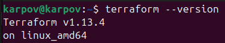

### Задание 1

1. Перейдите в каталог src. Скачайте все необходимые зависимости, использованные в проекте.
2. Изучите файл .gitignore. В каком terraform-файле, согласно этому .gitignore, допустимо сохранить личную, секретную информацию?(логины,пароли,ключи,токены итд)
3. Выполните код проекта. Найдите в state-файле секретное содержимое созданного ресурса random_password, пришлите в качестве ответа конкретный ключ и его значение.
4. Раскомментируйте блок кода, примерно расположенный на строчках 29–42 файла main.tf. Выполните команду terraform validate. Объясните, в чём заключаются намеренно допущенные ошибки. Исправьте их.
5. Выполните код. В качестве ответа приложите: исправленный фрагмент кода и вывод команды docker ps.
6. Замените имя docker-контейнера в блоке кода на hello_world. Не перепутайте имя контейнера и имя образа. Мы всё ещё продолжаем использовать name = "nginx:latest". Выполните команду terraform apply -auto-approve. Объясните своими словами, в чём может быть опасность применения ключа -auto-approve. Догадайтесь или нагуглите зачем может пригодиться данный ключ? В качестве ответа дополнительно приложите вывод команды docker ps.
7. Уничтожьте созданные ресурсы с помощью terraform. Убедитесь, что все ресурсы удалены. Приложите содержимое файла terraform.tfstate.
8. Объясните, почему при этом не был удалён docker-образ nginx:latest. Ответ ОБЯЗАТЕЛЬНО НАЙДИТЕ В ПРЕДОСТАВЛЕННОМ КОДЕ, а затем ОБЯЗАТЕЛЬНО ПОДКРЕПИТЕ строчкой из документации terraform провайдера docker. (ищите в классификаторе resource docker_image )

### Решение 1

Согласно .gitignore, допустимо сохранить личную, секретную информацию в файле personal.auto.tfvars, о чем даже вещает комментарий - own secret vars store - хранилище личных секретных переменных. 

Выполнен код проекта:

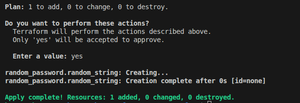

Содержимое ресурса random_password в tfstate:

"result": "IwA9ivW68nuNAEHa"

Расскоментировал блок с Docker и получил ошибку, которая говорит о том, что имя должно начинаться с буквы или подчеркивания:

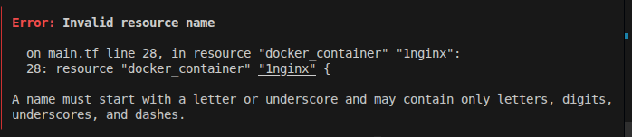

Также не было имени у ресурса "docker_image":

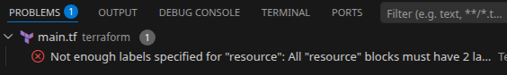

Кроме того, в строке 
```
name  = "example_${random_password.random_string_FAKE.resulT}"
```
2 ошибки - resulT с заглавной T и _FAKE.

Исправленный фрагмент кода:

```
resource "docker_image" "nginx" {
  name         = "nginx:latest"
  keep_locally = true
}

resource "docker_container" "nginx_container" {
  image = docker_image.nginx.image_id
  name  = "example_${random_password.random_string.result}"

  ports {
    internal = 80
    external = 9090
  }
}
```

Вывод команды docker ps:

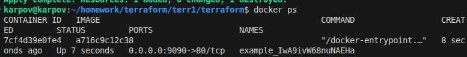

Изменено имя контейнера на hello_world, запуск с -auto-approve:

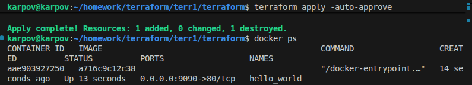

Опасность применения -auto-approve в том, что применятся все изменения без проверки плана и есть шанс затереть существующие ресурсы, например пересоздать БД, потеряв все данные. Или лишиться той ВМ, что уже есть. Еще один риск, если использовать terraform destroy -auto-approve. В этом случае инфраструктура уничтожится, не спрашивая согласия. 

Пригодиться данный ключ может при автоматизации, например, в CI/CD пайплайнах. Или например при запуске через cron. Также удобно для тестирования.

Ресурсы уничтожены, содержимое terraform.tfstate:

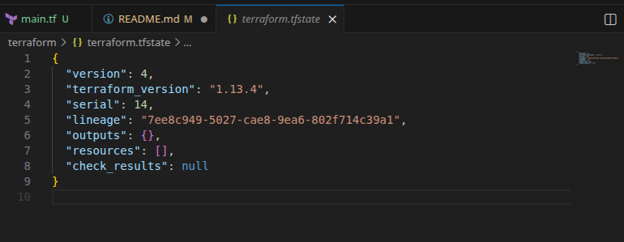

Docker-образ остался благодаря параметру keep_locally = true в main.tf, что прямо говорит о том, что образ не будет удален из локального хранилища. 

Выдержка из документации: 

keep_locally (Boolean) If true, then the Docker image won't be deleted on destroy operation. If this is false, it will delete the image from the docker local storage on destroy operation.


### Задание 2*

1. Создайте в облаке ВМ. Сделайте это через web-консоль, чтобы не слить по незнанию токен от облака в github(это тема следующей лекции). Если хотите - попробуйте сделать это через terraform, прочитав документацию yandex cloud. Используйте файл personal.auto.tfvars и гитигнор или иной, безопасный способ передачи токена!
2. Подключитесь к ВМ по ssh и установите стек docker.
3. Найдите в документации docker provider способ настроить подключение terraform на вашей рабочей станции к remote docker context вашей ВМ через ssh.
4. Используя terraform и remote docker context, скачайте и запустите на вашей ВМ контейнер mysql:8 на порту 127.0.0.1:3306, передайте ENV-переменные. Сгенерируйте разные пароли через random_password и передайте их в контейнер, используя интерполяцию из примера с nginx.(name  = "example_${random_password.random_string.result}" , двойные кавычки и фигурные скобки обязательны!)
    ```
    environment:
      - "MYSQL_ROOT_PASSWORD=${...}"
      - MYSQL_DATABASE=wordpress
      - MYSQL_USER=wordpress
      - "MYSQL_PASSWORD=${...}"
      - MYSQL_ROOT_HOST="%"
    ```
Зайдите на вашу ВМ , подключитесь к контейнеру и проверьте наличие секретных env-переменных с помощью команды env. Запишите ваш финальный код в репозиторий.

## Решение 2

Создана ВМ в YC, установлен Docker:

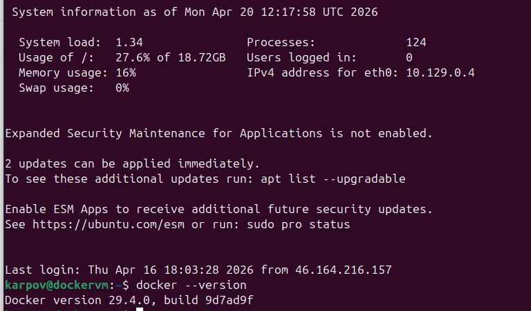

Написан [код](terr_context/main.tf) для настройки Mysql через Docker context.

Успешный запуск:

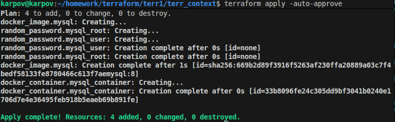

Проверка на ВМ:

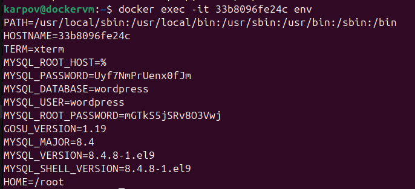


### Задание 3*

1. Установите opentofu(fork terraform с лицензией Mozilla Public License, version 2.0) любой версии
2. Попробуйте выполнить тот же код с помощью tofu apply, а не terraform apply.

### Решение 3

Для выполнения пришлось создать файл .tofurc и указать зеркало YC, без этого давало ошибку 403. Кроме того, пришлось чуть скорректировать версию (>=1.10.0, после выполнения вернул обратно как было), т.к. от Терраформа не подходила и тоже ругалось при init.

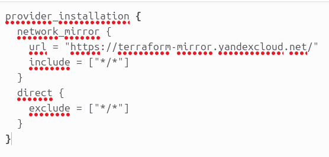

После этого все получилось:

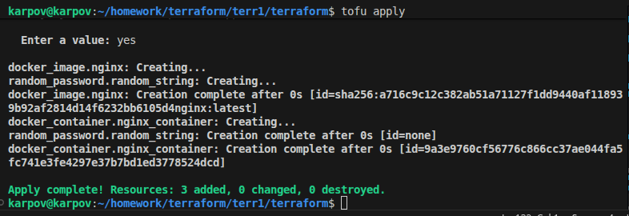

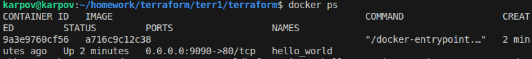