## Домашнее задание к занятию «Использование Terraform в команде». Карпов Антон Юрьевич

### Задание 1

1. Возьмите код:
- из ДЗ к лекции 4,
- из демо к лекции 4.

2. Проверьте код с помощью tflint и checkov. Вам не нужно инициализировать этот проект.
3. Перечислите, какие типы ошибок обнаружены в проекте (без дублей).

### Решение 1

#### tflint ДЗ к лекции 4

Ошибки:

- отсутствует указание версии для провайдера 
- переменные объявлены, но не используются

#### checkov ДЗ  к лекции 4 

Ошибок нет

#### tflint демо к лекции 4

/passwords - не указана версия провайдера "random"

/vms:

- указана ветка main при подключении github-репозитория 
- не указана версия провайдеров
- объявлена, но не используется переменная 

#### checkov демо к лекции 4

/passwords - нет ошибок

/vms:

- использование ветки вместо хэша коммита
- использование ветки вместо тэга

### Задание 2

1. Возьмите ваш GitHub-репозиторий с выполненным ДЗ 4 в ветке 'terraform-04' и сделайте из него ветку 'terraform-05'.
Настройте remote state с встроенными блокировками:
2. Создайте S3 bucket в Yandex Cloud для хранения state (если еще не создан)
3. Создайте service account с правами на чтение/запись в bucket
Настройте backend в providers.tf с использованием нового механизма блокировок:
```
terraform {
  required_version = "~>1.12.0"
  
  backend "s3" {
    bucket  = "ваш-bucket-name"
    key     = "terraform.tfstate"
    region  = "ru-central1"
    
    # Встроенный механизм блокировок (Terraform >= 1.6)
    # Не требует отдельной базы данных!
    use_lockfile = true
    
    endpoints = {
      s3 = "https://storage.yandexcloud.net"
    }
    
    skip_region_validation      = true
    skip_credentials_validation = true
    skip_requesting_account_id  = true
    skip_s3_checksum            = true
  }
}
```

- Выполните terraform init -migrate-state для миграции state в S3
- Предоставьте скриншоты процесса настройки и миграции

3. Закоммитьте в ветку 'terraform-05' все изменения.
4. Откройте в проекте terraform console, а в другом окне из этой же директории попробуйте запустить terraform apply.
5. Пришлите ответ об ошибке доступа к state (блокировка должна сработать автоматически).
6. Принудительно разблокируйте state командой terraform force-unlock <LOCK_ID>. Пришлите команду и вывод.

Примечание: В Terraform >= 1.6 появился встроенный механизм блокировок через use_lockfile = true. Это упрощает настройку - больше не нужно создавать отдельную базу данных (YDB в режиме DynamoDB) для хранения блокировок. Lock-файл создается автоматически в том же S3 bucket рядом с state-файлом с именем <key>.lock.info.

### Решение 2

[providers.tf](src/providers.tf)

Создана ветка terraform-05 из terraform-04.
S3 bucket был создан в предыдущем ДЗ:

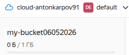

Выполнена инициализация:

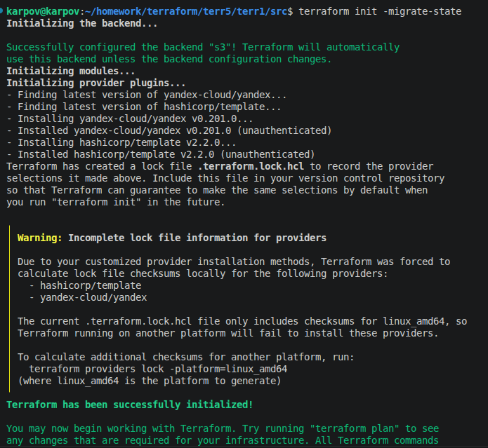

В первом окне терминала запущен terraform console:

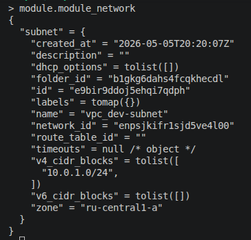

В другом окне терминала был запущен terraform apply  и получено сообщение о блокировке:

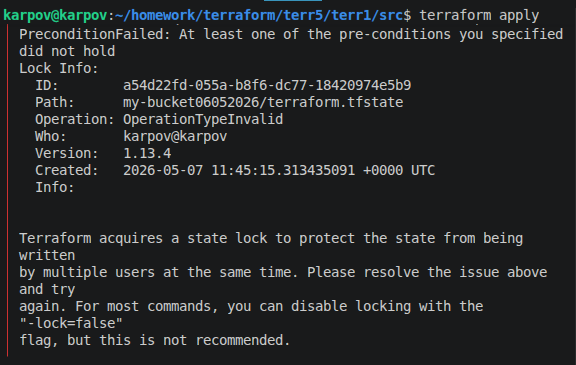

Принудительный запуск:

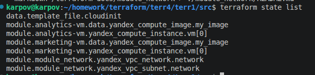


### Задание 3

1. Сделайте в GitHub из ветки 'terraform-05' новую ветку 'terraform-hotfix'.
2. Проверье код с помощью tflint и checkov, исправьте все предупреждения и ошибки в 'terraform-hotfix', сделайте коммит.
3. Откройте новый pull request 'terraform-hotfix' --> 'terraform-05'.
4. Вставьте в комментарий PR результат анализа tflint и checkov, план изменений инфраструктуры из вывода команды terraform plan.
5. Пришлите ссылку на PR для ревью. Вливать код в 'terraform-05' не нужно.

### Решение 3

Создана ветка terraform-hotfix:

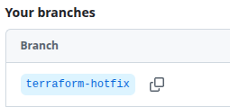

Проверен код с помощью tflint, по результатам внесены исправления:

- указаны версии провайдеров yandex и template
- в ссылках на гитхаб указание ветки main заменено на тег
- убраны неиспользуемые переменные

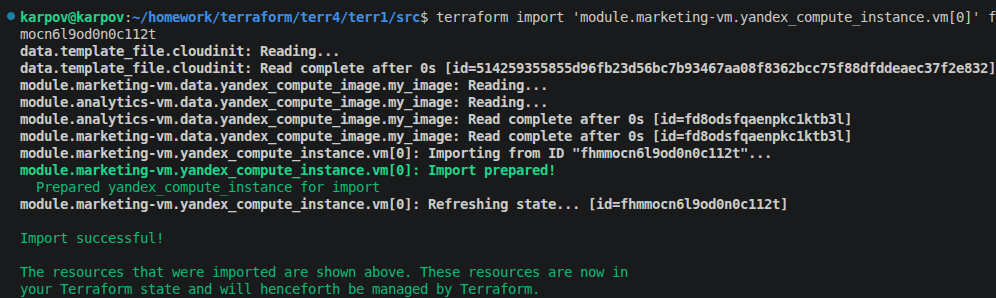

По результатам проверки checkov пришлось поменять в ссылках на гитхаб тег на коммит.

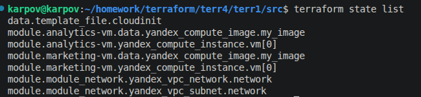

Ссылка на PR:

https://github.com/Entony/terr1/pull/1


### Задание 4

1. Напишите переменные с валидацией и протестируйте их, заполнив default верными и неверными значениями. Предоставьте скриншоты проверок из terraform console.

- type=string, description="ip-адрес" — проверка, что значение переменной содержит верный IP-адрес с помощью функций cidrhost() или regex(). Тесты: "192.168.0.1" и "1920.1680.0.1";
- type=list(string), description="список ip-адресов" — проверка, что все адреса верны. Тесты: ["192.168.0.1", "1.1.1.1", "127.0.0.1"] и ["192.168.0.1", "1.1.1.1", "1270.0.0.1"].

### Решение 4

[var_ip.tf](src/var_ip.tf)

Проверка с правильным значением IP-адреса:

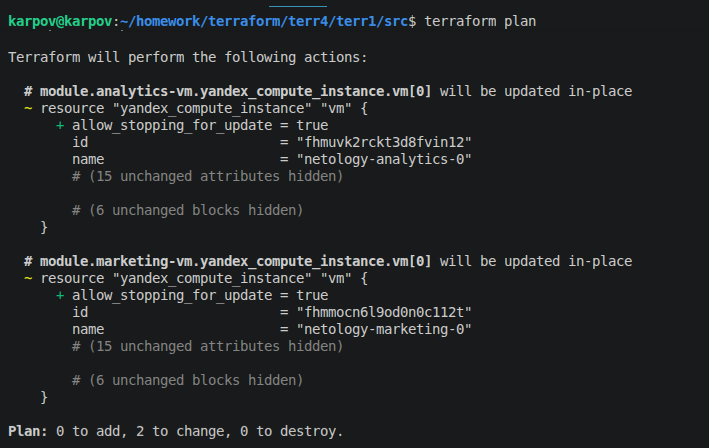

Проверка с неправильным значением:

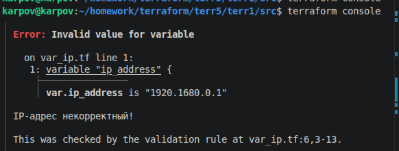

Проверка с правильным списком адресов:

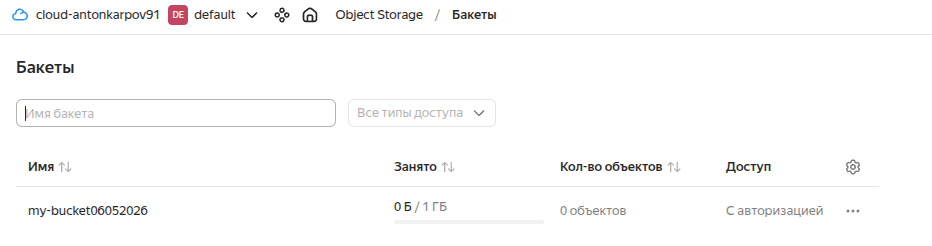

Проверка с неправильным списком адресов:

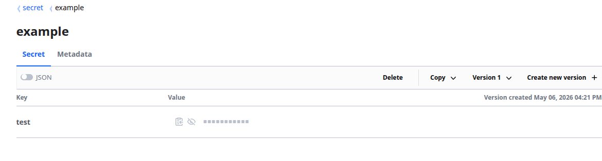


### Задание 5*

Напишите переменные с валидацией:
type=string, description="любая строка" — проверка, что строка не содержит символов верхнего регистра;
type=object — проверка, что одно из значений равно true, а второе false, т. е. не допускается false false и true true:
```
variable "in_the_end_there_can_be_only_one" {
    description="Who is better Connor or Duncan?"
    type = object({
        Dunkan = optional(bool)
        Connor = optional(bool)
    })

    default = {
        Dunkan = true
        Connor = false
    }

    validation {
        error_message = "There can be only one MacLeod"
        condition = <проверка>
    }
}
```

### Решение 5

[var_ex5.tf)](src/var_ex5.tf)

Проверка на верхний регистр:

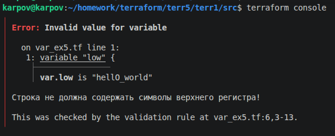

Когда правильно:

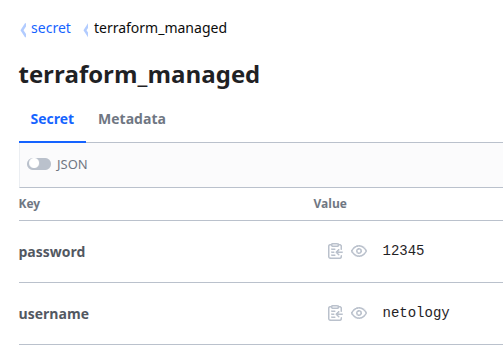

Проверка отсутствия двух одинаковых значений, если пара одинаковых значения:

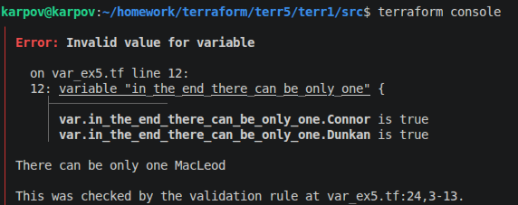


### Задание 6*


### Решение 6

[Jenkinsfile](Jenkinsfile)

Выбор действия (apply или destroy)

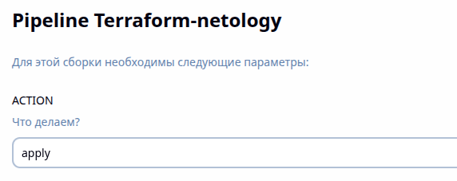

Спустя 14 попыток инфраструктура создана:

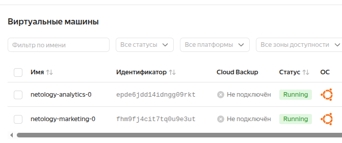

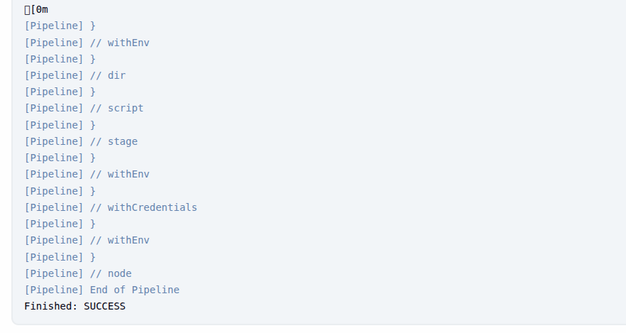

С помощью Jenfkins инфраструктура уничтожена:

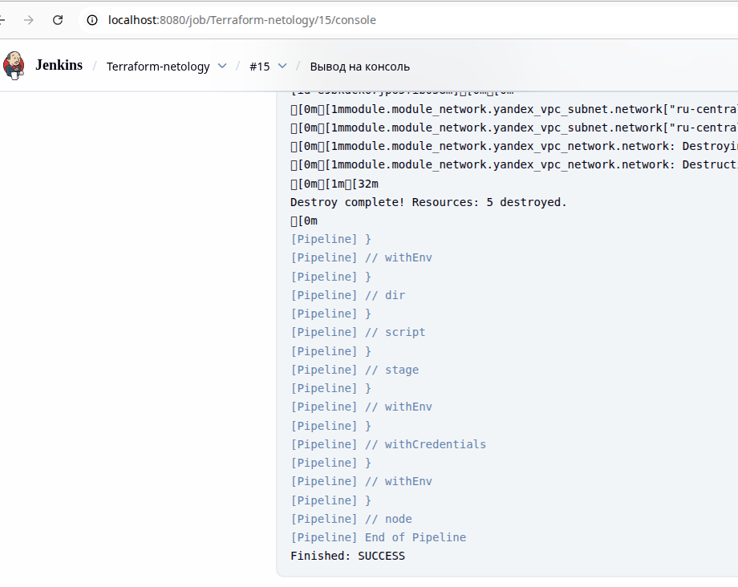


